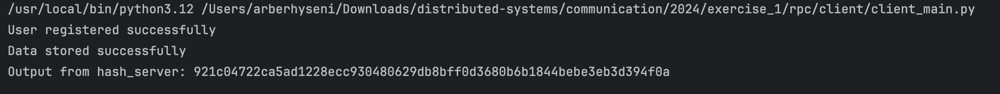

# Remote Procedure Call

### Manual for Running the Hash Server and Client
This guide provides instructions on how to generate gRPC code from `.proto` files and run both the server and client.

#### Prerequisites

- Python 3.x installed on the system.
- `python3 -m venv venv`
- `source venv/bin/activate`
- Install gRPC dependencies using:
- `pip` => `pip install grpcio grpcio-tools`
- `pip` => `pip install protobuf==5.27.2`

#### Folder Structure
- `client`: The _Client_ folder
- `hash_server`: The _Hash Server_ folder

#### Hash Server Running Instructions

**_Very Important_: Ensure that you are in `rpc` folder.**

1. First we will gRPC code from `.proto` file.
    - `cd hash_server`
    - `python3 -m grpc_tools.protoc -I. --python_out=./ --grpc_python_out=./ hash.proto`
    - `python3 -m grpc_tools.protoc -I. --python_out=./ --grpc_python_out=./ data.proto`
    - `cd ..`

2. Run the server:
- `cd hash_server`
- `python3 hash_server_main.py`

#### Client Running Instructions
**_Very Important_: Ensure that you are in `rpc` folder.**

1. Run the client:
- `cd ..`
- `cd client`
- on the _grpc generated files add `from hash_server` on the import line
- `python3 client_main.py --username <username-here> --password <password-here>`

Output:

